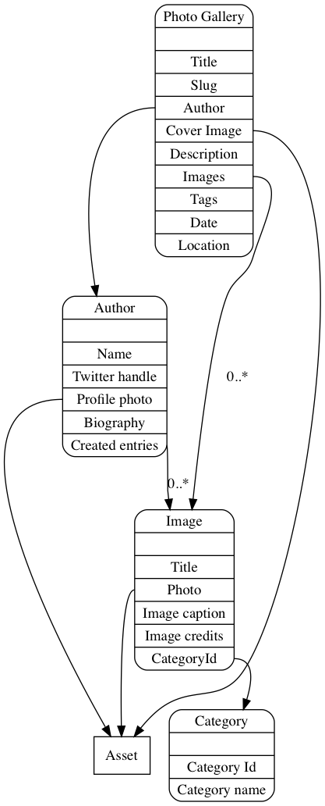

[](https://travis-ci.org/lotas/contentful-graph)

# contentful-graph
Visual representation of contentful content models in form of graphs




# Installation

This script create a `*.dot` file for a contentful content models, which requires `graphviz` to be installed if you want to render Graph.

```
npm i
```

In order to run the `./import.js` script you need to know:

1. Space ID
2. Delivery token or Management token

**Management token** has an advantage of showing one-to-one relationships for models (as pointed by @jelz in #1)

There are several options of providing those: either through `.env` file:

```
CONTENTFUL_SPACE_ID= spaceId
CONTENTFUL_TOKEN= deliveryToken
CONTENTFUL_MANAGEMENT_TOKEN= or management token
```

or simply in command-line:

`CONTENTFUL_SPACE_ID=123 CONTENTFUL_MANAGEMENT_TOKEN=token ./import.js`


# Usage

Simply run `./import.js` to get the DOT output

```
$./import.js

digraph obj {
  node[shape=record];

  Image [label="{Image |        | <title> Title|<photo> Photo|<imageCaption> Image caption|<imageCredits> Image credits|<categoryId> CategoryId}" shape=Mrecord];
  Asset
  Author [label="{Author |        | <name> Name|<twitterHandle> Twitter handle|<profilePhoto> Profile photo|<biography> Biography|<createdEntries> Created entries}" shape=Mrecord];
  Category [label="{Category |        | <categoryId> Category Id|<categoryName> Category name}" shape=Mrecord];
  PhotoGallery [label="{Photo Gallery |        | <title> Title|<slug> Slug|<author> Author|<coverImage> Cover Image|<description> Description|<images> Images|<tags> Tags|<date> Date|<location> Location}" shape=Mrecord];

  Image:photo -> Asset [dir=forward];
  Image:categoryId -> Category [dir=forward];
  Author:profilePhoto -> Asset [dir=forward];
  Author:createdEntries -> Image [dir=forward,label="1..*"];
  PhotoGallery:author -> Author [dir=forward];
  PhotoGallery:coverImage -> Asset [dir=forward];
  PhotoGallery:images -> Image [dir=forward,label="1..*"];
}
```

To render this to image or PDF, pipe it to the `dot` command:

```
./import.js | dot -Tpng > model.png
./import.js | dot -Tpdf > model.pdf
```

## Links

[Contentful Management API](https://www.contentful.com/developers/docs/references/content-management-api/#/reference/content-types)

[Contentful Delivery API](https://www.contentful.com/developers/docs/references/content-delivery-api/#/reference/content-types)

[GraphViz Fiddle](http://stamm-wilbrandt.de/GraphvizFiddle/)
